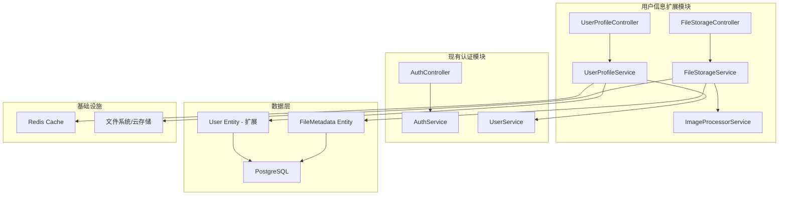
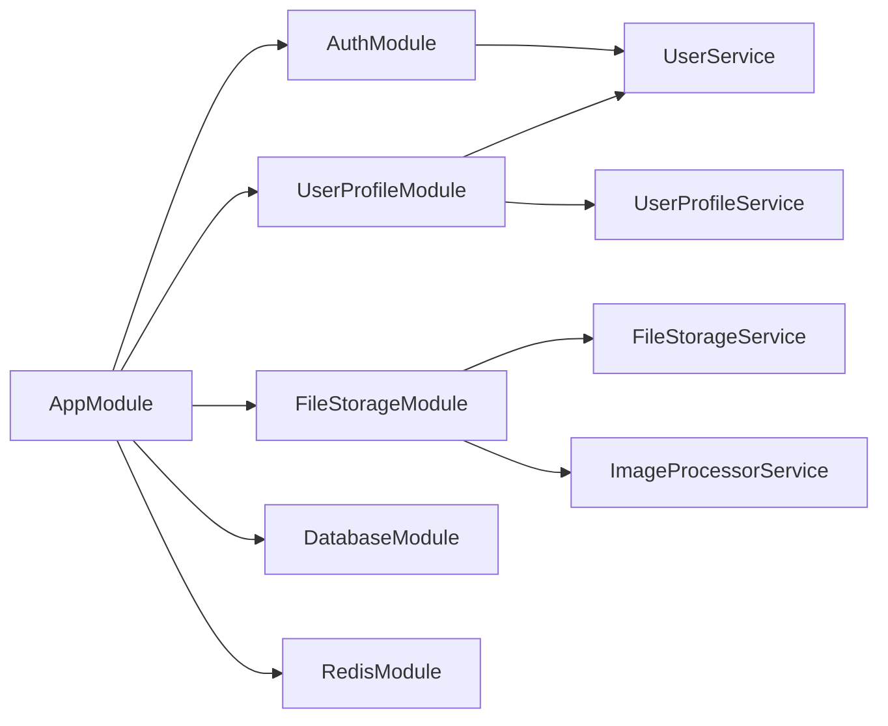
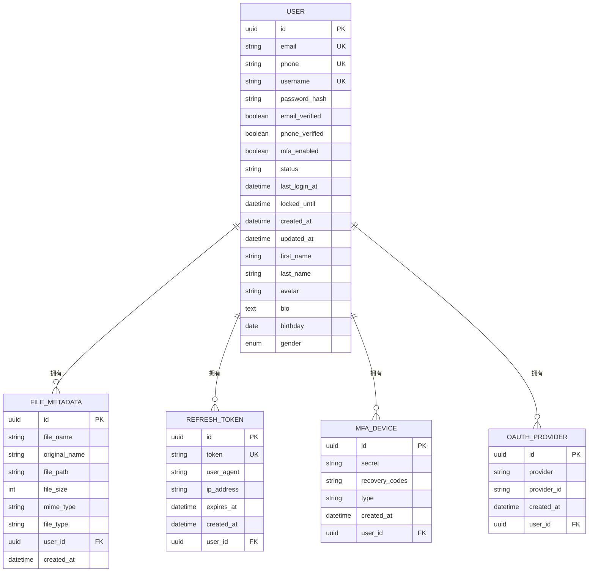

# 用户信息扩展设计文档

## 概述

本设计文档旨在扩展现有的 NestJS 认证系统，为 iOS App 提供完整的用户信息管理功能。基于现有的 `User` 实体，新增个人信息字段和相关管理模块，包括姓名、头像、简历等个人信息的管理功能。

### 目标
- 扩展 User 实体以支持 iOS App 所需的个人信息字段
- 创建用户信息管理模块，提供完整的 CRUD 操作
- 实现安全的头像上传和文件管理功能
- 为移动端优化 API 响应格式和性能
- 保持与现有认证系统的完全兼容性

### 技术栈
- **框架**: NestJS + TypeScript
- **数据库**: PostgreSQL + TypeORM
- **缓存**: Redis
- **文件存储**: 本地存储 / 云存储（可扩展）
- **图片处理**: Sharp
- **验证**: class-validator

## 架构设计

### 整体架构



### 模块关系



## 数据模型

### User 实体扩展

基于现有的 User 实体，新增以下字段：

```typescript
// 在现有 User 实体中添加的字段
export class User {
  // ... 现有字段

  // 新增个人信息字段
  @Column({ name: 'first_name', nullable: true })
  firstName?: string;

  @Column({ name: 'last_name', nullable: true })  
  lastName?: string;

  @Column({ nullable: true })
  avatar?: string;

  @Column({ type: 'text', nullable: true })
  bio?: string;

  @Column({ nullable: true })
  birthday?: Date;

  @Column({
    type: 'enum',
    enum: ['male', 'female', 'other'],
    nullable: true,
  })
  gender?: 'male' | 'female' | 'other';

  // 新增业务方法
  getFullName(): string {
    return [this.firstName, this.lastName].filter(Boolean).join(' ');
  }

  getDisplayName(): string {
    return this.getFullName() || this.username || this.email?.split('@')[0] || 'User';
  }

  isProfileComplete(): boolean {
    return !!(this.firstName && this.lastName);
  }
}
```

### 文件元数据实体

```typescript
@Entity('file_metadata')
export class FileMetadata {
  @PrimaryGeneratedColumn('uuid')
  id: string;

  @Column({ name: 'file_name' })
  fileName: string;

  @Column({ name: 'original_name' })
  originalName: string;

  @Column({ name: 'file_path' })
  filePath: string;

  @Column({ name: 'file_size' })
  fileSize: number;

  @Column({ name: 'mime_type' })
  mimeType: string;

  @Column({ name: 'file_type' })
  fileType: string; // 'avatar', 'document', etc.

  @Column({ name: 'user_id' })
  userId: string;

  @CreateDateColumn({ name: 'created_at' })
  createdAt: Date;

  @ManyToOne(() => User)
  @JoinColumn({ name: 'user_id' })
  user: User;
}
```

### 数据库设计



## API 设计

### 用户信息管理 API

#### 获取用户信息
```
GET /api/v1/user/profile
Authorization: Bearer <access_token>

响应:
{
  "id": "uuid",
  "email": "user@example.com",
  "username": "johndoe",
  "firstName": "John",
  "lastName": "Doe",
  "avatar": "https://cdn.example.com/avatars/uuid.jpg",
  "bio": "Software Engineer",
  "birthday": "1990-01-15",
  "gender": "male",
  "emailVerified": true,
  "phoneVerified": false,
  "profileComplete": true,
  "createdAt": "2023-01-01T00:00:00Z",
  "updatedAt": "2023-12-01T00:00:00Z"
}
```

#### 更新用户信息
```
PUT /api/v1/user/profile
Authorization: Bearer <access_token>
Content-Type: application/json

请求体:
{
  "firstName": "John",
  "lastName": "Doe",
  "bio": "Senior Software Engineer",
  "birthday": "1990-01-15",
  "gender": "male"
}

响应:
{
  "success": true,
  "message": "Profile updated successfully",
  "data": {
    // 更新后的用户信息
  }
}
```

### 头像管理 API

#### 上传头像
```
POST /api/v1/user/avatar
Authorization: Bearer <access_token>
Content-Type: multipart/form-data

Form Data:
- file: <image_file>

响应:
{
  "success": true,
  "message": "Avatar uploaded successfully",
  "data": {
    "avatar": "https://cdn.example.com/avatars/uuid.jpg",
    "thumbnails": {
      "small": "https://cdn.example.com/avatars/uuid_small.jpg",
      "medium": "https://cdn.example.com/avatars/uuid_medium.jpg"
    }
  }
}
```

#### 删除头像
```
DELETE /api/v1/user/avatar
Authorization: Bearer <access_token>

响应:
{
  "success": true,
  "message": "Avatar deleted successfully"
}
```

### DTO 设计

```typescript
// 更新用户信息 DTO
export class UpdateProfileDto {
  @IsOptional()
  @IsString()
  @Length(1, 50)
  firstName?: string;

  @IsOptional()
  @IsString()
  @Length(1, 50)
  lastName?: string;

  @IsOptional()
  @IsString()
  @MaxLength(500)
  bio?: string;

  @IsOptional()
  @IsDate()
  @Type(() => Date)
  birthday?: Date;

  @IsOptional()
  @IsEnum(['male', 'female', 'other'])
  gender?: 'male' | 'female' | 'other';
}

// 用户信息响应 DTO
export class UserProfileResponseDto {
  id: string;
  email?: string;
  phone?: string;
  username?: string;
  firstName?: string;
  lastName?: string;
  avatar?: string;
  bio?: string;
  birthday?: Date;
  gender?: string;
  emailVerified: boolean;
  phoneVerified: boolean;
  profileComplete: boolean;
  createdAt: Date;
  updatedAt: Date;

  constructor(user: User) {
    Object.assign(this, user);
    this.profileComplete = user.isProfileComplete();
  }
}
```

## 业务逻辑层

### UserProfileService

```typescript
@Injectable()
export class UserProfileService {
  constructor(
    @InjectRepository(User)
    private userRepository: Repository<User>,
    private cacheService: CacheService,
  ) {}

  async getProfile(userId: string): Promise<UserProfileResponseDto> {
    // 实现用户信息获取逻辑
    // 支持缓存机制
  }

  async updateProfile(
    userId: string,
    updateDto: UpdateProfileDto,
  ): Promise<UserProfileResponseDto> {
    // 实现用户信息更新逻辑
    // 数据验证和清理
    // 更新缓存
  }

  async updateAvatar(userId: string, avatarUrl: string): Promise<void> {
    // 更新用户头像URL
    // 删除旧头像文件
  }

  private async validateProfileData(data: UpdateProfileDto): Promise<void> {
    // 实现数据验证逻辑
  }
}
```

### FileStorageService

```typescript
@Injectable()
export class FileStorageService {
  constructor(
    @InjectRepository(FileMetadata)
    private fileRepository: Repository<FileMetadata>,
    private imageProcessorService: ImageProcessorService,
  ) {}

  async uploadAvatar(
    userId: string,
    file: Express.Multer.File,
  ): Promise<AvatarUploadResponseDto> {
    // 文件验证
    // 图片处理和压缩
    // 生成多尺寸头像
    // 保存文件元数据
  }

  async deleteFile(fileId: string, userId: string): Promise<void> {
    // 删除文件和元数据
  }

  private generateFileName(originalName: string): string {
    // 生成安全的文件名
  }
}
```

### ImageProcessorService

```typescript
@Injectable()
export class ImageProcessorService {
  async processAvatar(
    file: Express.Multer.File,
    userId: string,
  ): Promise<ProcessedAvatarDto> {
    // 使用 Sharp 处理图片
    // 生成缩略图
    // 压缩优化
  }

  private async resizeImage(
    inputBuffer: Buffer,
    width: number,
    height: number,
  ): Promise<Buffer> {
    // 图片缩放逻辑
  }
}
```

## 安全设计

### 文件上传安全

```typescript
// 文件验证配置
export const AVATAR_UPLOAD_CONFIG = {
  fileFilter: (req: any, file: Express.Multer.File, callback: any) => {
    const allowedMimes = ['image/jpeg', 'image/png', 'image/webp'];
    if (allowedMimes.includes(file.mimetype)) {
      callback(null, true);
    } else {
      callback(new BadRequestException('Invalid file type'), false);
    }
  },
  limits: {
    fileSize: 5 * 1024 * 1024, // 5MB
  },
};

// 文件安全验证
export class FileValidator {
  static validateImageFile(file: Express.Multer.File): void {
    // MIME 类型验证
    // 文件头验证
    // 恶意文件检测
  }

  static sanitizeFileName(fileName: string): string {
    // 文件名清理
  }
}
```

### 权限控制

```typescript
@UseGuards(JwtAuthGuard)
export class UserProfileController {
  // 确保只有认证用户能访问
  // 用户只能操作自己的资源
}

// 资源权限检查
export class ResourceOwnershipGuard implements CanActivate {
  canActivate(context: ExecutionContext): boolean {
    // 检查资源所有权
  }
}
```

## 性能优化

### 缓存策略

```typescript
@Injectable()
export class UserProfileService {
  // 用户信息缓存
  async getProfile(userId: string): Promise<UserProfileResponseDto> {
    const cacheKey = `user_profile:${userId}`;
    
    // 尝试从缓存获取
    let profile = await this.cacheService.get(cacheKey);
    
    if (!profile) {
      // 从数据库查询
      profile = await this.userRepository.findOne({ where: { id: userId } });
      
      // 设置缓存，30分钟过期
      await this.cacheService.set(cacheKey, profile, 1800);
    }
    
    return new UserProfileResponseDto(profile);
  }

  // 更新时清除缓存
  async updateProfile(userId: string, updateDto: UpdateProfileDto): Promise<void> {
    // 更新数据库
    await this.userRepository.update(userId, updateDto);
    
    // 清除缓存
    await this.cacheService.del(`user_profile:${userId}`);
  }
}
```

### 数据库优化

```sql
-- 添加索引优化查询性能
CREATE INDEX idx_users_first_name ON users(first_name);
CREATE INDEX idx_users_last_name ON users(last_name);
CREATE INDEX idx_users_gender ON users(gender);
CREATE INDEX idx_file_metadata_user_id_type ON file_metadata(user_id, file_type);
```

### API 响应优化

```typescript
// 分层响应 - 基础信息
export class UserBasicInfoDto {
  id: string;
  username?: string;
  firstName?: string;
  lastName?: string;
  avatar?: string;
}

// 分层响应 - 完整信息
export class UserFullProfileDto extends UserBasicInfoDto {
  email?: string;
  phone?: string;
  bio?: string;
  birthday?: Date;
  gender?: string;
  emailVerified: boolean;
  phoneVerified: boolean;
  profileComplete: boolean;
}

// 根据客户端需求返回不同层级的数据
@Get('profile')
async getProfile(
  @CurrentUser() user: User,
  @Query('level') level: 'basic' | 'full' = 'full',
): Promise<UserBasicInfoDto | UserFullProfileDto> {
  if (level === 'basic') {
    return new UserBasicInfoDto(user);
  }
  return new UserFullProfileDto(user);
}
```

## 数据迁移

### 数据库迁移脚本

```sql
-- 001_add_user_profile_fields.sql
ALTER TABLE users 
ADD COLUMN first_name VARCHAR(50),
ADD COLUMN last_name VARCHAR(50),
ADD COLUMN avatar VARCHAR(255),
ADD COLUMN bio TEXT,
ADD COLUMN birthday DATE,
ADD COLUMN gender VARCHAR(10) CHECK (gender IN ('male', 'female', 'other'));

-- 创建索引
CREATE INDEX idx_users_first_name ON users(first_name);
CREATE INDEX idx_users_last_name ON users(last_name);
CREATE INDEX idx_users_gender ON users(gender);

-- 002_create_file_metadata_table.sql
CREATE TABLE file_metadata (
    id UUID PRIMARY KEY DEFAULT gen_random_uuid(),
    file_name VARCHAR(255) NOT NULL,
    original_name VARCHAR(255) NOT NULL,
    file_path VARCHAR(500) NOT NULL,
    file_size INTEGER NOT NULL,
    mime_type VARCHAR(100) NOT NULL,
    file_type VARCHAR(50) NOT NULL,
    user_id UUID NOT NULL,
    created_at TIMESTAMP DEFAULT CURRENT_TIMESTAMP,
    FOREIGN KEY (user_id) REFERENCES users(id) ON DELETE CASCADE
);

CREATE INDEX idx_file_metadata_user_id_type ON file_metadata(user_id, file_type);
```

### TypeORM 迁移

```typescript
@Migration()
export class AddUserProfileFields1234567890123 implements MigrationInterface {
  public async up(queryRunner: QueryRunner): Promise<void> {
    await queryRunner.addColumns('users', [
      new TableColumn({
        name: 'first_name',
        type: 'varchar',
        length: '50',
        isNullable: true,
      }),
      // ... 其他字段
    ]);

    // 创建索引
    await queryRunner.createIndices('users', [
      new TableIndex({
        name: 'idx_users_first_name',
        columnNames: ['first_name'],
      }),
      // ... 其他索引
    ]);
  }

  public async down(queryRunner: QueryRunner): Promise<void> {
    // 回滚逻辑
  }
}
```

## 测试策略

### 单元测试覆盖

```typescript
// UserProfileService 测试
describe('UserProfileService', () => {
  let service: UserProfileService;
  let userRepository: Repository<User>;

  beforeEach(async () => {
    // 测试设置
  });

  describe('getProfile', () => {
    it('should return user profile successfully', async () => {
      // 测试获取用户信息
    });

    it('should return cached profile if available', async () => {
      // 测试缓存功能
    });
  });

  describe('updateProfile', () => {
    it('should update user profile successfully', async () => {
      // 测试更新用户信息
    });

    it('should validate input data', async () => {
      // 测试数据验证
    });

    it('should clear cache after update', async () => {
      // 测试缓存清理
    });
  });
});

// FileStorageService 测试
describe('FileStorageService', () => {
  describe('uploadAvatar', () => {
    it('should upload avatar successfully', async () => {
      // 测试头像上传
    });

    it('should generate multiple sizes', async () => {
      // 测试多尺寸生成
    });

    it('should reject invalid file types', async () => {
      // 测试文件类型验证
    });
  });
});
```

### 集成测试

```typescript
// E2E 测试
describe('User Profile E2E', () => {
  it('should complete user profile flow', async () => {
    // 1. 用户注册
    // 2. 登录获取令牌
    // 3. 更新个人信息
    // 4. 上传头像
    // 5. 验证信息完整性
  });
});
```

## 错误处理

### 异常定义

```typescript
export class ProfileException extends HttpException {
  constructor(message: string, status: HttpStatus) {
    super(message, status);
  }
}

export class FileUploadException extends ProfileException {
  constructor(message: string = 'File upload failed') {
    super(message, HttpStatus.BAD_REQUEST);
  }
}

export class InvalidFileTypeException extends FileUploadException {
  constructor() {
    super('Invalid file type. Only JPEG, PNG, and WebP are allowed.');
  }
}

export class FileSizeLimitException extends FileUploadException {
  constructor() {
    super('File size exceeds the maximum limit of 5MB.');
  }
}
```

### 全局异常处理

```typescript
@Catch()
export class AllExceptionsFilter implements ExceptionFilter {
  catch(exception: unknown, host: ArgumentsHost) {
    const ctx = host.switchToHttp();
    const response = ctx.getResponse<Response>();
    const request = ctx.getRequest<Request>();

    let status = HttpStatus.INTERNAL_SERVER_ERROR;
    let message = 'Internal server error';

    if (exception instanceof HttpException) {
      status = exception.getStatus();
      message = exception.message;
    }

    // 记录错误日志
    this.logger.error(
      `${request.method} ${request.url}`,
      exception instanceof Error ? exception.stack : exception,
    );

    response.status(status).json({
      success: false,
      error: {
        code: status,
        message,
        timestamp: new Date().toISOString(),
        path: request.url,
      },
    });
  }
}
```

## 监控和日志

### 关键指标监控

```typescript
// 性能监控
@Injectable()
export class MetricsService {
  private readonly profileUpdateCounter = new Counter({
    name: 'profile_updates_total',
    help: 'Total number of profile updates',
    labelNames: ['status'],
  });

  private readonly avatarUploadDuration = new Histogram({
    name: 'avatar_upload_duration_seconds',
    help: 'Avatar upload duration',
    buckets: [0.1, 0.5, 1, 2, 5],
  });

  recordProfileUpdate(success: boolean): void {
    this.profileUpdateCounter.inc({ status: success ? 'success' : 'error' });
  }

  recordAvatarUpload(duration: number): void {
    this.avatarUploadDuration.observe(duration);
  }
}
```

### 审计日志

```typescript
@Injectable()
export class AuditLogService {
  async logProfileUpdate(userId: string, changes: Partial<User>): Promise<void> {
    const logEntry = {
      userId,
      action: 'PROFILE_UPDATE',
      changes: Object.keys(changes),
      timestamp: new Date(),
      userAgent: this.request.get('User-Agent'),
      ipAddress: this.getClientIp(),
    };

    // 记录到数据库或日志系统
    await this.auditRepository.save(logEntry);
  }

  async logFileUpload(userId: string, fileType: string, fileSize: number): Promise<void> {
    // 记录文件操作
  }
}
```- 实现安全的头像上传和文件管理功能
- 为移动端优化 API 响应格式和性能
- 保持与现有认证系统的完全兼容性

### 技术栈
- **框架**: NestJS + TypeScript
- **数据库**: PostgreSQL + TypeORM
- **缓存**: Redis
- **文件存储**: 本地存储 / 云存储（可扩展）
- **图片处理**: Sharp
- **验证**: class-validator

## 架构设计

### 整体架构


### 模块关系


## 数据模型

### User 实体扩展

基于现有的 User 实体，新增以下字段：

```typescript
// 在现有 User 实体中添加的字段
export class User {
  // ... 现有字段

  // 新增个人信息字段
  @Column({ name: 'first_name', nullable: true })
  firstName?: string;

  @Column({ name: 'last_name', nullable: true })  
  lastName?: string;

  @Column({ nullable: true })
  avatar?: string;

  @Column({ type: 'text', nullable: true })
  bio?: string;

  @Column({ nullable: true })
  birthday?: Date;

  @Column({
    type: 'enum',
    enum: ['male', 'female', 'other'],
    nullable: true,
  })
  gender?: 'male' | 'female' | 'other';

  // 新增业务方法
  getFullName(): string {
    return [this.firstName, this.lastName].filter(Boolean).join(' ');
  }

  getDisplayName(): string {
    return this.getFullName() || this.username || this.email?.split('@')[0] || 'User';
  }

  isProfileComplete(): boolean {
    return !!(this.firstName && this.lastName);
  }
}
```

### 文件元数据实体

```typescript
@Entity('file_metadata')
export class FileMetadata {
  @PrimaryGeneratedColumn('uuid')
  id: string;

  @Column({ name: 'file_name' })
  fileName: string;

  @Column({ name: 'original_name' })
  originalName: string;

  @Column({ name: 'file_path' })
  filePath: string;

  @Column({ name: 'file_size' })
  fileSize: number;

  @Column({ name: 'mime_type' })
  mimeType: string;

  @Column({ name: 'file_type' })
  fileType: string; // 'avatar', 'document', etc.

  @Column({ name: 'user_id' })
  userId: string;

  @CreateDateColumn({ name: 'created_at' })
  createdAt: Date;

  @ManyToOne(() => User)
  @JoinColumn({ name: 'user_id' })
  user: User;
}
```

### 数据库设计


## API 设计

### 用户信息管理 API

#### 获取用户信息
```
GET /api/v1/user/profile
Authorization: Bearer <access_token>

响应:
{
  "id": "uuid",
  "email": "user@example.com",
  "username": "johndoe",
  "firstName": "John",
  "lastName": "Doe",
  "avatar": "https://cdn.example.com/avatars/uuid.jpg",
  "bio": "Software Engineer",
  "birthday": "1990-01-15",
  "gender": "male",
  "emailVerified": true,
  "phoneVerified": false,
  "profileComplete": true,
  "createdAt": "2023-01-01T00:00:00Z",
  "updatedAt": "2023-12-01T00:00:00Z"
}
```

#### 更新用户信息
```
PUT /api/v1/user/profile
Authorization: Bearer <access_token>
Content-Type: application/json

请求体:
{
  "firstName": "John",
  "lastName": "Doe",
  "bio": "Senior Software Engineer",
  "birthday": "1990-01-15",
  "gender": "male"
}

响应:
{
  "success": true,
  "message": "Profile updated successfully",
  "data": {
    // 更新后的用户信息
  }
}
```

### 头像管理 API

#### 上传头像
```
POST /api/v1/user/avatar
Authorization: Bearer <access_token>
Content-Type: multipart/form-data

Form Data:
- file: <image_file>

响应:
{
  "success": true,
  "message": "Avatar uploaded successfully",
  "data": {
    "avatar": "https://cdn.example.com/avatars/uuid.jpg",
    "thumbnails": {
      "small": "https://cdn.example.com/avatars/uuid_small.jpg",
      "medium": "https://cdn.example.com/avatars/uuid_medium.jpg"
    }
  }
}
```

#### 删除头像
```
DELETE /api/v1/user/avatar
Authorization: Bearer <access_token>

响应:
{
  "success": true,
  "message": "Avatar deleted successfully"
}
```

### DTO 设计

```typescript
// 更新用户信息 DTO
export class UpdateProfileDto {
  @IsOptional()
  @IsString()
  @Length(1, 50)
  firstName?: string;

  @IsOptional()
  @IsString()
  @Length(1, 50)
  lastName?: string;

  @IsOptional()
  @IsString()
  @MaxLength(500)
  bio?: string;

  @IsOptional()
  @IsDate()
  @Type(() => Date)
  birthday?: Date;

  @IsOptional()
  @IsEnum(['male', 'female', 'other'])
  gender?: 'male' | 'female' | 'other';
}

// 用户信息响应 DTO
export class UserProfileResponseDto {
  id: string;
  email?: string;
  phone?: string;
  username?: string;
  firstName?: string;
  lastName?: string;
  avatar?: string;
  bio?: string;
  birthday?: Date;
  gender?: string;
  emailVerified: boolean;
  phoneVerified: boolean;
  profileComplete: boolean;
  createdAt: Date;
  updatedAt: Date;

  constructor(user: User) {
    Object.assign(this, user);
    this.profileComplete = user.isProfileComplete();
  }
}
```

## 业务逻辑层

### UserProfileService

```typescript
@Injectable()
export class UserProfileService {
  constructor(
    @InjectRepository(User)
    private userRepository: Repository<User>,
    private cacheService: CacheService,
  ) {}

  async getProfile(userId: string): Promise<UserProfileResponseDto> {
    // 实现用户信息获取逻辑
    // 支持缓存机制
  }

  async updateProfile(
    userId: string,
    updateDto: UpdateProfileDto,
  ): Promise<UserProfileResponseDto> {
    // 实现用户信息更新逻辑
    // 数据验证和清理
    // 更新缓存
  }

  async updateAvatar(userId: string, avatarUrl: string): Promise<void> {
    // 更新用户头像URL
    // 删除旧头像文件
  }

  private async validateProfileData(data: UpdateProfileDto): Promise<void> {
    // 实现数据验证逻辑
  }
}
```

### FileStorageService

```typescript
@Injectable()
export class FileStorageService {
  constructor(
    @InjectRepository(FileMetadata)
    private fileRepository: Repository<FileMetadata>,
    private imageProcessorService: ImageProcessorService,
  ) {}

  async uploadAvatar(
    userId: string,
    file: Express.Multer.File,
  ): Promise<AvatarUploadResponseDto> {
    // 文件验证
    // 图片处理和压缩
    // 生成多尺寸头像
    // 保存文件元数据
  }

  async deleteFile(fileId: string, userId: string): Promise<void> {
    // 删除文件和元数据
  }

  private generateFileName(originalName: string): string {
    // 生成安全的文件名
  }
}
```

### ImageProcessorService

```typescript
@Injectable()
export class ImageProcessorService {
  async processAvatar(
    file: Express.Multer.File,
    userId: string,
  ): Promise<ProcessedAvatarDto> {
    // 使用 Sharp 处理图片
    // 生成缩略图
    // 压缩优化
  }

  private async resizeImage(
    inputBuffer: Buffer,
    width: number,
    height: number,
  ): Promise<Buffer> {
    // 图片缩放逻辑
  }
}
```

## 安全设计

### 文件上传安全

```typescript
// 文件验证配置
export const AVATAR_UPLOAD_CONFIG = {
  fileFilter: (req: any, file: Express.Multer.File, callback: any) => {
    const allowedMimes = ['image/jpeg', 'image/png', 'image/webp'];
    if (allowedMimes.includes(file.mimetype)) {
      callback(null, true);
    } else {
      callback(new BadRequestException('Invalid file type'), false);
    }
  },
  limits: {
    fileSize: 5 * 1024 * 1024, // 5MB
  },
};

// 文件安全验证
export class FileValidator {
  static validateImageFile(file: Express.Multer.File): void {
    // MIME 类型验证
    // 文件头验证
    // 恶意文件检测
  }

  static sanitizeFileName(fileName: string): string {
    // 文件名清理
  }
}
```

### 权限控制

```typescript
@UseGuards(JwtAuthGuard)
export class UserProfileController {
  // 确保只有认证用户能访问
  // 用户只能操作自己的资源
}

// 资源权限检查
export class ResourceOwnershipGuard implements CanActivate {
  canActivate(context: ExecutionContext): boolean {
    // 检查资源所有权
  }
}
```

## 性能优化

### 缓存策略

```typescript
@Injectable()
export class UserProfileService {
  // 用户信息缓存
  async getProfile(userId: string): Promise<UserProfileResponseDto> {
    const cacheKey = `user_profile:${userId}`;
    
    // 尝试从缓存获取
    let profile = await this.cacheService.get(cacheKey);
    
    if (!profile) {
      // 从数据库查询
      profile = await this.userRepository.findOne({ where: { id: userId } });
      
      // 设置缓存，30分钟过期
      await this.cacheService.set(cacheKey, profile, 1800);
    }
    
    return new UserProfileResponseDto(profile);
  }

  // 更新时清除缓存
  async updateProfile(userId: string, updateDto: UpdateProfileDto): Promise<void> {
    // 更新数据库
    await this.userRepository.update(userId, updateDto);
    
    // 清除缓存
    await this.cacheService.del(`user_profile:${userId}`);
  }
}
```

### 数据库优化

```sql
-- 添加索引优化查询性能
CREATE INDEX idx_users_first_name ON users(first_name);
CREATE INDEX idx_users_last_name ON users(last_name);
CREATE INDEX idx_users_gender ON users(gender);
CREATE INDEX idx_file_metadata_user_id_type ON file_metadata(user_id, file_type);
```

### API 响应优化

```typescript
// 分层响应 - 基础信息
export class UserBasicInfoDto {
  id: string;
  username?: string;
  firstName?: string;
  lastName?: string;
  avatar?: string;
}

// 分层响应 - 完整信息
export class UserFullProfileDto extends UserBasicInfoDto {
  email?: string;
  phone?: string;
  bio?: string;
  birthday?: Date;
  gender?: string;
  emailVerified: boolean;
  phoneVerified: boolean;
  profileComplete: boolean;
}

// 根据客户端需求返回不同层级的数据
@Get('profile')
async getProfile(
  @CurrentUser() user: User,
  @Query('level') level: 'basic' | 'full' = 'full',
): Promise<UserBasicInfoDto | UserFullProfileDto> {
  if (level === 'basic') {
    return new UserBasicInfoDto(user);
  }
  return new UserFullProfileDto(user);
}
```

## 数据迁移

### 数据库迁移脚本

```sql
-- 001_add_user_profile_fields.sql
ALTER TABLE users 
ADD COLUMN first_name VARCHAR(50),
ADD COLUMN last_name VARCHAR(50),
ADD COLUMN avatar VARCHAR(255),
ADD COLUMN bio TEXT,
ADD COLUMN birthday DATE,
ADD COLUMN gender VARCHAR(10) CHECK (gender IN ('male', 'female', 'other'));

-- 创建索引
CREATE INDEX idx_users_first_name ON users(first_name);
CREATE INDEX idx_users_last_name ON users(last_name);
CREATE INDEX idx_users_gender ON users(gender);

-- 002_create_file_metadata_table.sql
CREATE TABLE file_metadata (
    id UUID PRIMARY KEY DEFAULT gen_random_uuid(),
    file_name VARCHAR(255) NOT NULL,
    original_name VARCHAR(255) NOT NULL,
    file_path VARCHAR(500) NOT NULL,
    file_size INTEGER NOT NULL,
    mime_type VARCHAR(100) NOT NULL,
    file_type VARCHAR(50) NOT NULL,
    user_id UUID NOT NULL,
    created_at TIMESTAMP DEFAULT CURRENT_TIMESTAMP,
    FOREIGN KEY (user_id) REFERENCES users(id) ON DELETE CASCADE
);

CREATE INDEX idx_file_metadata_user_id_type ON file_metadata(user_id, file_type);
```

### TypeORM 迁移

```typescript
@Migration()
export class AddUserProfileFields1234567890123 implements MigrationInterface {
  public async up(queryRunner: QueryRunner): Promise<void> {
    await queryRunner.addColumns('users', [
      new TableColumn({
        name: 'first_name',
        type: 'varchar',
        length: '50',
        isNullable: true,
      }),
      // ... 其他字段
    ]);

    // 创建索引
    await queryRunner.createIndices('users', [
      new TableIndex({
        name: 'idx_users_first_name',
        columnNames: ['first_name'],
      }),
      // ... 其他索引
    ]);
  }

  public async down(queryRunner: QueryRunner): Promise<void> {
    // 回滚逻辑
  }
}
```

## 测试策略

### 单元测试覆盖

```typescript
// UserProfileService 测试
describe('UserProfileService', () => {
  let service: UserProfileService;
  let userRepository: Repository<User>;

  beforeEach(async () => {
    // 测试设置
  });

  describe('getProfile', () => {
    it('should return user profile successfully', async () => {
      // 测试获取用户信息
    });

    it('should return cached profile if available', async () => {
      // 测试缓存功能
    });
  });

  describe('updateProfile', () => {
    it('should update user profile successfully', async () => {
      // 测试更新用户信息
    });

    it('should validate input data', async () => {
      // 测试数据验证
    });

    it('should clear cache after update', async () => {
      // 测试缓存清理
    });
  });
});

// FileStorageService 测试
describe('FileStorageService', () => {
  describe('uploadAvatar', () => {
    it('should upload avatar successfully', async () => {
      // 测试头像上传
    });

    it('should generate multiple sizes', async () => {
      // 测试多尺寸生成
    });

    it('should reject invalid file types', async () => {
      // 测试文件类型验证
    });
  });
});
```

### 集成测试

```typescript
// E2E 测试
describe('User Profile E2E', () => {
  it('should complete user profile flow', async () => {
    // 1. 用户注册
    // 2. 登录获取令牌
    // 3. 更新个人信息
    // 4. 上传头像
    // 5. 验证信息完整性
  });
});
```

## 错误处理

### 异常定义

```typescript
export class ProfileException extends HttpException {
  constructor(message: string, status: HttpStatus) {
    super(message, status);
  }
}

export class FileUploadException extends ProfileException {
  constructor(message: string = 'File upload failed') {
    super(message, HttpStatus.BAD_REQUEST);
  }
}

export class InvalidFileTypeException extends FileUploadException {
  constructor() {
    super('Invalid file type. Only JPEG, PNG, and WebP are allowed.');
  }
}

export class FileSizeLimitException extends FileUploadException {
  constructor() {
    super('File size exceeds the maximum limit of 5MB.');
  }
}
```

### 全局异常处理

```typescript
@Catch()
export class AllExceptionsFilter implements ExceptionFilter {
  catch(exception: unknown, host: ArgumentsHost) {
    const ctx = host.switchToHttp();
    const response = ctx.getResponse<Response>();
    const request = ctx.getRequest<Request>();

    let status = HttpStatus.INTERNAL_SERVER_ERROR;
    let message = 'Internal server error';

    if (exception instanceof HttpException) {
      status = exception.getStatus();
      message = exception.message;
    }

    // 记录错误日志
    this.logger.error(
      `${request.method} ${request.url}`,
      exception instanceof Error ? exception.stack : exception,
    );

    response.status(status).json({
      success: false,
      error: {
        code: status,
        message,
        timestamp: new Date().toISOString(),
        path: request.url,
      },
    });
  }
}
```

## 监控和日志

### 关键指标监控

```typescript
// 性能监控
@Injectable()
export class MetricsService {
  private readonly profileUpdateCounter = new Counter({
    name: 'profile_updates_total',
    help: 'Total number of profile updates',
    labelNames: ['status'],
  });

  private readonly avatarUploadDuration = new Histogram({
    name: 'avatar_upload_duration_seconds',
    help: 'Avatar upload duration',
    buckets: [0.1, 0.5, 1, 2, 5],
  });

  recordProfileUpdate(success: boolean): void {
    this.profileUpdateCounter.inc({ status: success ? 'success' : 'error' });
  }

  recordAvatarUpload(duration: number): void {
    this.avatarUploadDuration.observe(duration);
  }
}
```

### 审计日志

```typescript
@Injectable()
export class AuditLogService {
  async logProfileUpdate(userId: string, changes: Partial<User>): Promise<void> {
    const logEntry = {
      userId,
      action: 'PROFILE_UPDATE',
      changes: Object.keys(changes),
      timestamp: new Date(),
      userAgent: this.request.get('User-Agent'),
      ipAddress: this.getClientIp(),
    };

    // 记录到数据库或日志系统
    await this.auditRepository.save(logEntry);
  }

  async logFileUpload(userId: string, fileType: string, fileSize: number): Promise<void> {
    // 记录文件操作
  }
}
```


