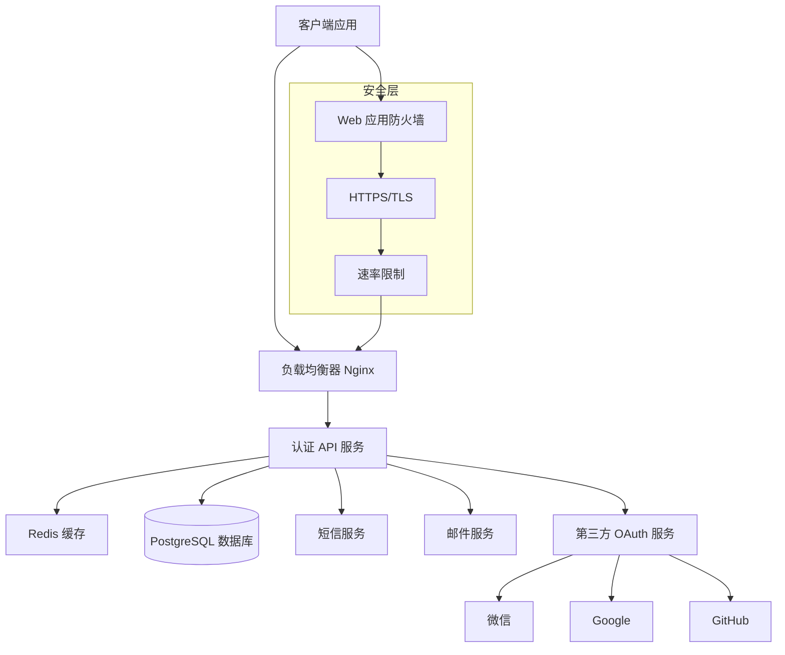
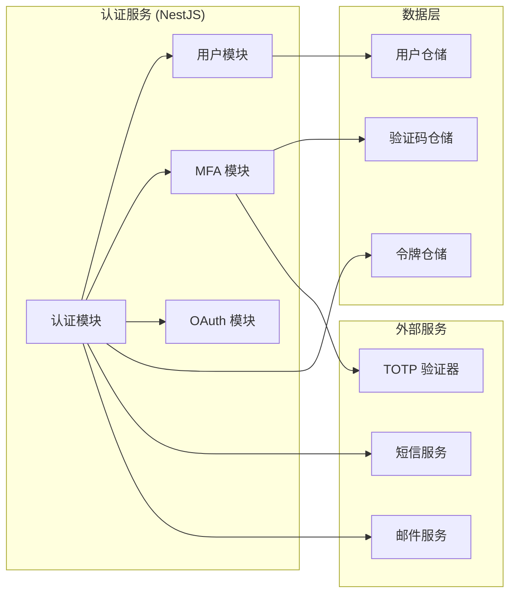
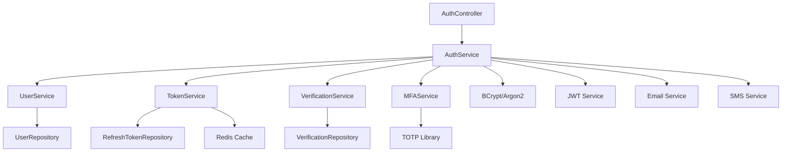

# 用户注册与认证系统技术设计文档

## 1. 概述

本文档基于提供的最佳实践需求文档，设计一个使用 Node.js 技术栈的安全、可扩展的用户注册与认证系统。系统采用现代化的微服务架构，支持多种认证方式，并严格遵循安全最佳实践。

### 1.1 核心目标
- 提供安全可靠的用户注册、登录、身份验证功能
- 支持多因素认证(MFA)和第三方登录
- 基于 JWT 的无状态认证机制
- 高可用、高性能的分布式架构

### 1.2 技术栈
- **运行时**: Node.js 18+ 
- **框架**: NestJS (TypeScript)
- **数据库**: PostgreSQL 14+
- **缓存**: Redis 7+
- **认证**: JWT + Passport.js
- **密码哈希**: bcrypt / Argon2
- **验证**: class-validator + class-transformer

## 2. 架构设计

### 2.1 整体架构



### 2.2 核心模块架构



## 3. 数据模型设计

### 3.1 数据库 Schema (PostgreSQL)

#### Users 表
```sql
CREATE TABLE users (
    id UUID PRIMARY KEY DEFAULT gen_random_uuid(),
    email VARCHAR(255) UNIQUE,
    phone VARCHAR(20) UNIQUE,
    username VARCHAR(50) UNIQUE,
    password_hash TEXT NOT NULL,
    email_verified BOOLEAN DEFAULT FALSE,
    phone_verified BOOLEAN DEFAULT FALSE,
    mfa_enabled BOOLEAN DEFAULT FALSE,
    mfa_secret TEXT, -- 加密存储
    status user_status DEFAULT 'active',
    failed_login_attempts INTEGER DEFAULT 0,
    locked_until TIMESTAMP,
    last_login_at TIMESTAMP,
    created_at TIMESTAMP DEFAULT CURRENT_TIMESTAMP,
    updated_at TIMESTAMP DEFAULT CURRENT_TIMESTAMP
);

CREATE TYPE user_status AS ENUM ('active', 'locked', 'disabled', 'pending');

CREATE INDEX idx_users_email ON users(email);
CREATE INDEX idx_users_phone ON users(phone);
CREATE INDEX idx_users_username ON users(username);
CREATE INDEX idx_users_status ON users(status);
```

#### Refresh Tokens 表
```sql
CREATE TABLE refresh_tokens (
    id UUID PRIMARY KEY DEFAULT gen_random_uuid(),
    user_id UUID NOT NULL REFERENCES users(id) ON DELETE CASCADE,
    token_hash TEXT NOT NULL,
    expires_at TIMESTAMP NOT NULL,
    revoked BOOLEAN DEFAULT FALSE,
    device_info TEXT,
    ip_address INET,
    created_at TIMESTAMP DEFAULT CURRENT_TIMESTAMP,
    updated_at TIMESTAMP DEFAULT CURRENT_TIMESTAMP
);

CREATE INDEX idx_refresh_tokens_user_id ON refresh_tokens(user_id);
CREATE INDEX idx_refresh_tokens_hash ON refresh_tokens(token_hash);
CREATE INDEX idx_refresh_tokens_expires_at ON refresh_tokens(expires_at);
```

#### OAuth Providers 表
```sql
CREATE TABLE oauth_providers (
    id UUID PRIMARY KEY DEFAULT gen_random_uuid(),
    user_id UUID NOT NULL REFERENCES users(id) ON DELETE CASCADE,
    provider oauth_provider NOT NULL,
    provider_user_id VARCHAR(255) NOT NULL,
    access_token TEXT,
    refresh_token TEXT,
    expires_at TIMESTAMP,
    created_at TIMESTAMP DEFAULT CURRENT_TIMESTAMP,
    updated_at TIMESTAMP DEFAULT CURRENT_TIMESTAMP,
    UNIQUE(provider, provider_user_id)
);

CREATE TYPE oauth_provider AS ENUM ('google', 'github', 'wechat', 'apple');

CREATE INDEX idx_oauth_providers_user_id ON oauth_providers(user_id);
CREATE INDEX idx_oauth_providers_provider ON oauth_providers(provider, provider_user_id);
```

#### Verification Codes 表
```sql
CREATE TABLE verification_codes (
    id UUID PRIMARY KEY DEFAULT gen_random_uuid(),
    target VARCHAR(255) NOT NULL,
    code_hash TEXT NOT NULL,
    type verification_type NOT NULL,
    expires_at TIMESTAMP NOT NULL,
    used BOOLEAN DEFAULT FALSE,
    attempts INTEGER DEFAULT 0,
    created_at TIMESTAMP DEFAULT CURRENT_TIMESTAMP
);

CREATE TYPE verification_type AS ENUM ('register', 'reset_password', 'login_mfa', 'email_verify', 'phone_verify');

CREATE INDEX idx_verification_codes_target ON verification_codes(target, type);
CREATE INDEX idx_verification_codes_expires_at ON verification_codes(expires_at);
```

### 3.2 TypeScript 实体定义

```typescript
// User Entity
@Entity('users')
export class User {
  @PrimaryGeneratedColumn('uuid')
  id: string;

  @Column({ unique: true, nullable: true })
  email?: string;

  @Column({ unique: true, nullable: true })
  phone?: string;

  @Column({ unique: true, nullable: true })
  username?: string;

  @Column({ name: 'password_hash', select: false })
  passwordHash: string;

  @Column({ name: 'email_verified', default: false })
  emailVerified: boolean;

  @Column({ name: 'phone_verified', default: false })
  phoneVerified: boolean;

  @Column({ name: 'mfa_enabled', default: false })
  mfaEnabled: boolean;

  @Column({ name: 'mfa_secret', nullable: true, select: false })
  mfaSecret?: string;

  @Column({ type: 'enum', enum: UserStatus, default: UserStatus.ACTIVE })
  status: UserStatus;

  @Column({ name: 'failed_login_attempts', default: 0 })
  failedLoginAttempts: number;

  @Column({ name: 'locked_until', nullable: true })
  lockedUntil?: Date;

  @Column({ name: 'last_login_at', nullable: true })
  lastLoginAt?: Date;

  @CreateDateColumn({ name: 'created_at' })
  createdAt: Date;

  @UpdateDateColumn({ name: 'updated_at' })
  updatedAt: Date;

  @OneToMany(() => RefreshToken, token => token.user)
  refreshTokens: RefreshToken[];

  @OneToMany(() => OAuthProvider, provider => provider.user)
  oauthProviders: OAuthProvider[];
}

export enum UserStatus {
  ACTIVE = 'active',
  LOCKED = 'locked',
  DISABLED = 'disabled',
  PENDING = 'pending'
}
```

## 4. 核心服务实现

### 4.1 认证服务架构



### 4.2 关键服务接口

#### AuthService 核心接口
```typescript
@Injectable()
export class AuthService {
  // 用户注册
  async register(dto: RegisterDto): Promise<AuthResponse>;
  
  // 密码登录
  async login(dto: LoginDto): Promise<AuthResponse>;
  
  // MFA 验证
  async verifyMFA(dto: MFAVerifyDto): Promise<AuthResponse>;
  
  // 第三方登录
  async oauthLogin(provider: string, profile: OAuthProfile): Promise<AuthResponse>;
  
  // 刷新令牌
  async refreshToken(refreshToken: string): Promise<AuthResponse>;
  
  // 登出
  async logout(refreshToken: string): Promise<void>;
  
  // 重置密码
  async resetPassword(dto: ResetPasswordDto): Promise<void>;
  
  // 发送验证码
  async sendVerificationCode(dto: SendCodeDto): Promise<void>;
}
```

#### TokenService 接口
```typescript
@Injectable()
export class TokenService {
  // 生成 JWT 访问令牌
  generateAccessToken(payload: JWTPayload): string;
  
  // 生成刷新令牌
  async generateRefreshToken(userId: string, deviceInfo?: string): Promise<string>;
  
  // 验证访问令牌
  verifyAccessToken(token: string): JWTPayload | null;
  
  // 验证刷新令牌
  async verifyRefreshToken(token: string): Promise<RefreshToken | null>;
  
  // 吊销刷新令牌
  async revokeRefreshToken(tokenId: string): Promise<void>;
  
  // 清理过期令牌
  async cleanupExpiredTokens(): Promise<void>;
}
```

### 4.3 安全中间件

#### JWT 认证中间件
```typescript
@Injectable()
export class JwtAuthGuard implements CanActivate {
  constructor(
    private jwtService: JwtService,
    private userService: UserService,
  ) {}

  async canActivate(context: ExecutionContext): Promise<boolean> {
    const request = context.switchToHttp().getRequest();
    const token = this.extractTokenFromHeader(request);
    
    if (!token) {
      throw new UnauthorizedException('Access token required');
    }

    try {
      const payload = this.jwtService.verify(token);
      const user = await this.userService.findById(payload.sub);
      
      if (!user || user.status !== UserStatus.ACTIVE) {
        throw new UnauthorizedException('Invalid user');
      }

      request.user = user;
      return true;
    } catch (error) {
      throw new UnauthorizedException('Invalid access token');
    }
  }

  private extractTokenFromHeader(request: Request): string | undefined {
    const [type, token] = request.headers.authorization?.split(' ') ?? [];
    return type === 'Bearer' ? token : undefined;
  }
}
```

#### 速率限制中间件
```typescript
@Injectable()
export class RateLimitGuard implements CanActivate {
  constructor(private redisService: RedisService) {}

  async canActivate(context: ExecutionContext): Promise<boolean> {
    const request = context.switchToHttp().getRequest();
    const key = this.getKey(request);
    
    const current = await this.redisService.incr(key);
    
    if (current === 1) {
      await this.redisService.expire(key, 900); // 15分钟窗口
    }
    
    if (current > 5) { // 最多5次尝试
      throw new TooManyRequestsException('Too many attempts');
    }
    
    return true;
  }

  private getKey(request: Request): string {
    const ip = request.ip;
    const email = request.body?.email || 'unknown';
    return `rate_limit:login:${ip}:${email}`;
  }
}
```

## 5. API 接口设计

### 5.1 认证控制器

```typescript
@Controller('api/v1/auth')
@ApiTags('Authentication')
export class AuthController {
  constructor(private readonly authService: AuthService) {}

  @Post('register')
  @ApiOperation({ summary: '用户注册' })
  async register(@Body() dto: RegisterDto): Promise<ApiResponse<AuthResponse>> {
    const result = await this.authService.register(dto);
    return {
      success: true,
      message: '注册成功',
      data: result
    };
  }

  @Post('login')
  @UseGuards(RateLimitGuard)
  @ApiOperation({ summary: '用户登录' })
  async login(@Body() dto: LoginDto): Promise<ApiResponse<AuthResponse>> {
    const result = await this.authService.login(dto);
    return {
      success: true,
      message: '登录成功',
      data: result
    };
  }

  @Post('refresh')
  @ApiOperation({ summary: '刷新访问令牌' })
  async refresh(@Body() dto: RefreshTokenDto): Promise<ApiResponse<AuthResponse>> {
    const result = await this.authService.refreshToken(dto.refreshToken);
    return {
      success: true,
      message: '令牌刷新成功',
      data: result
    };
  }

  @Post('logout')
  @UseGuards(JwtAuthGuard)
  @ApiOperation({ summary: '用户登出' })
  async logout(@Body() dto: LogoutDto): Promise<ApiResponse<void>> {
    await this.authService.logout(dto.refreshToken);
    return {
      success: true,
      message: '登出成功'
    };
  }

  @Get('me')
  @UseGuards(JwtAuthGuard)
  @ApiOperation({ summary: '获取当前用户信息' })
  async getCurrentUser(@Request() req): Promise<ApiResponse<UserProfile>> {
    return {
      success: true,
      data: this.mapToUserProfile(req.user)
    };
  }
}
```

### 5.2 DTO 定义

```typescript
// 注册 DTO
export class RegisterDto {
  @IsEmail()
  @IsOptional()
  email?: string;

  @IsPhoneNumber()
  @IsOptional()
  phone?: string;

  @IsString()
  @Length(6, 6)
  verificationCode: string;

  @IsString()
  @MinLength(8)
  @Matches(/^(?=.*[a-z])(?=.*[A-Z])(?=.*\d)(?=.*[@$!%*?&])[A-Za-z\d@$!%*?&]/, {
    message: '密码必须包含大小写字母、数字和特殊字符'
  })
  password: string;

  @IsString()
  confirmPassword: string;

  @ValidateIf(o => o.password !== o.confirmPassword)
  @IsEmpty({ message: '密码确认不匹配' })
  passwordMatch?: any;
}

// 登录 DTO
export class LoginDto {
  @IsString()
  identifier: string; // 邮箱、手机号或用户名

  @IsString()
  password: string;

  @IsOptional()
  @IsString()
  @Length(6, 6)
  mfaCode?: string;

  @IsOptional()
  @IsString()
  deviceInfo?: string;
}
```

## 6. 安全实现详情

### 6.1 密码安全

```typescript
@Injectable()
export class PasswordService {
  private readonly saltRounds = 12;

  async hashPassword(password: string): Promise<string> {
    return bcrypt.hash(password, this.saltRounds);
  }

  async verifyPassword(password: string, hash: string): Promise<boolean> {
    return bcrypt.compare(password, hash);
  }

  validatePasswordStrength(password: string): boolean {
    const minLength = 8;
    const hasUpperCase = /[A-Z]/.test(password);
    const hasLowerCase = /[a-z]/.test(password);
    const hasNumbers = /\d/.test(password);
    const hasSpecialChar = /[@$!%*?&]/.test(password);

    return password.length >= minLength && 
           hasUpperCase && 
           hasLowerCase && 
           hasNumbers && 
           hasSpecialChar;
  }
}
```

### 6.2 MFA 实现

```typescript
@Injectable()
export class MFAService {
  async generateTOTPSecret(userId: string): Promise<{ secret: string; qrCode: string }> {
    const secret = speakeasy.generateSecret({
      name: `AuthForge:${userId}`,
      issuer: 'AuthForge'
    });

    // 加密存储密钥
    const encryptedSecret = await this.encryptionService.encrypt(secret.base32);
    await this.userService.updateMFASecret(userId, encryptedSecret);

    return {
      secret: secret.base32,
      qrCode: secret.otpauth_url
    };
  }

  async verifyTOTP(userId: string, token: string): Promise<boolean> {
    const user = await this.userService.findById(userId);
    if (!user.mfaSecret) {
      return false;
    }

    const decryptedSecret = await this.encryptionService.decrypt(user.mfaSecret);
    
    return speakeasy.totp.verify({
      secret: decryptedSecret,
      encoding: 'base32',
      token,
      window: 2 // 允许时间窗口偏移
    });
  }
}
```

### 6.3 验证码服务

```typescript
@Injectable()
export class VerificationService {
  private readonly codeLength = 6;
  private readonly expiryMinutes = 10;

  async sendVerificationCode(
    target: string, 
    type: VerificationType
  ): Promise<void> {
    // 生成6位随机数字验证码
    const code = Math.random().toString().substr(2, this.codeLength);
    const hashedCode = await bcrypt.hash(code, 10);
    
    // 存储验证码
    await this.verificationRepository.save({
      target,
      codeHash: hashedCode,
      type,
      expiresAt: new Date(Date.now() + this.expiryMinutes * 60 * 1000)
    });

    // 发送验证码
    if (this.isEmail(target)) {
      await this.emailService.sendVerificationCode(target, code);
    } else {
      await this.smsService.sendVerificationCode(target, code);
    }
  }

  async verifyCode(
    target: string, 
    code: string, 
    type: VerificationType
  ): Promise<boolean> {
    const verification = await this.verificationRepository.findOne({
      where: { target, type, used: false },
      order: { createdAt: 'DESC' }
    });

    if (!verification || verification.expiresAt < new Date()) {
      return false;
    }

    const isValid = await bcrypt.compare(code, verification.codeHash);
    
    if (isValid) {
      verification.used = true;
      await this.verificationRepository.save(verification);
    }

    return isValid;
  }
}
```

## 7. 测试策略

### 7.1 单元测试

```typescript
describe('AuthService', () => {
  let service: AuthService;
  let userService: jest.Mocked<UserService>;
  let tokenService: jest.Mocked<TokenService>;

  beforeEach(async () => {
    const module: TestingModule = await Test.createTestingModule({
      providers: [
        AuthService,
        {
          provide: UserService,
          useValue: {
            findByEmail: jest.fn(),
            create: jest.fn(),
            updateLoginAttempts: jest.fn(),
          }
        },
        {
          provide: TokenService,
          useValue: {
            generateAccessToken: jest.fn(),
            generateRefreshToken: jest.fn(),
          }
        }
      ],
    }).compile();

    service = module.get<AuthService>(AuthService);
    userService = module.get(UserService);
    tokenService = module.get(TokenService);
  });

  describe('register', () => {
    it('should register user successfully', async () => {
      const dto: RegisterDto = {
        email: 'test@example.com',
        password: 'SecurePass123!',
        confirmPassword: 'SecurePass123!',
        verificationCode: '123456'
      };

      userService.create.mockResolvedValue(mockUser);
      tokenService.generateAccessToken.mockReturnValue('access_token');
      tokenService.generateRefreshToken.mockResolvedValue('refresh_token');

      const result = await service.register(dto);

      expect(result).toEqual({
        accessToken: 'access_token',
        refreshToken: 'refresh_token',
        user: expect.any(Object)
      });
    });
  });

  describe('login', () => {
    it('should login user successfully', async () => {
      const dto: LoginDto = {
        identifier: 'test@example.com',
        password: 'SecurePass123!'
      };

      userService.findByEmail.mockResolvedValue(mockUser);
      jest.spyOn(service, 'verifyPassword').mockResolvedValue(true);

      const result = await service.login(dto);

      expect(result.accessToken).toBeDefined();
      expect(result.refreshToken).toBeDefined();
    });

    it('should throw error for invalid credentials', async () => {
      const dto: LoginDto = {
        identifier: 'test@example.com',
        password: 'wrong_password'
      };

      userService.findByEmail.mockResolvedValue(mockUser);
      jest.spyOn(service, 'verifyPassword').mockResolvedValue(false);

      await expect(service.login(dto)).rejects.toThrow('Invalid credentials');
    });
  });
});
```

### 7.2 集成测试

```typescript
describe('Auth API (e2e)', () => {
  let app: INestApplication;
  let userRepository: Repository<User>;

  beforeEach(async () => {
    const moduleFixture: TestingModule = await Test.createTestingModule({
      imports: [AppModule],
    }).compile();

    app = moduleFixture.createNestApplication();
    userRepository = moduleFixture.get('UserRepository');
    await app.init();
  });

  describe('/auth/register (POST)', () => {
    it('should register new user', () => {
      return request(app.getHttpServer())
        .post('/api/v1/auth/register')
        .send({
          email: 'test@example.com',
          password: 'SecurePass123!',
          confirmPassword: 'SecurePass123!',
          verificationCode: '123456'
        })
        .expect(201)
        .expect(res => {
          expect(res.body.success).toBe(true);
          expect(res.body.data.accessToken).toBeDefined();
        });
    });
  });

  describe('/auth/login (POST)', () => {
    beforeEach(async () => {
      // 创建测试用户
      await userRepository.save({
        email: 'test@example.com',
        passwordHash: await bcrypt.hash('SecurePass123!', 12),
        emailVerified: true,
        status: UserStatus.ACTIVE
      });
    });

    it('should login with valid credentials', () => {
      return request(app.getHttpServer())
        .post('/api/v1/auth/login')
        .send({
          identifier: 'test@example.com',
          password: 'SecurePass123!'
        })
        .expect(200)
        .expect(res => {
          expect(res.body.data.accessToken).toBeDefined();
          expect(res.body.data.refreshToken).toBeDefined();
        });
    });
  });
});
```
